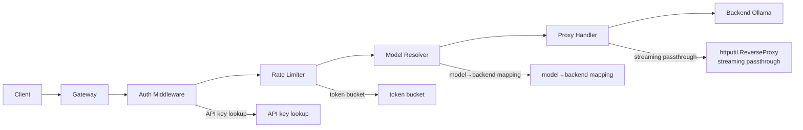

# Ollama Gateway

A gateway for Ollama servers, with a web admin control panel. Share your inference with your friends!

Featuring:

- **API key authentication** (SHA-256 hashing) with separate admin token for dashboard access
- **Token-bucket rate limiting** per API key (burst-friendly, configurable rate/burst)
- **Model catalog management** — global catalog + per-user overrides (allow/deny lists, aliases)
- **Weighted load balancing** across backends with health-check failover
- **Usage & cost tracking** — token counts, calculated costs per 1M tokens, SQLite persistence
- **Embedded HTMX admin dashboard** for monitoring and configuration, including user creation
- **Optional HTTPS listener** with certificate hot reload and expiry warnings

Single-binary deployment using `net/http` + `html/template`. No web framework.

## Contributing

See [`CONTRIBUTING.md`](CONTRIBUTING.md) for contributor setup, test expectations, docs/spec update guidance, and pull request requirements.

## Quick Start

```bash
# Build the gateway binary
go build -o bin/gateway ./cmd/gateway/

# Copy example config and edit it
cp configs/config.example.yaml configs/config.yaml
# Edit configs/config.yaml with your backends, models, admin token hash, pricing, etc.
# Users are stored in SQLite and can be created from /admin/users.

# Run
./bin/gateway --config configs/config.yaml
```

Admin dashboard is available at `http://localhost:4080/admin/` (or `https://` if TLS is configured). Use the admin token hash from the YAML to log in.

The gateway listens on `0.0.0.0:4080` by default (configurable in the YAML).

Notes:

- If `database.path` is omitted, the gateway defaults to `/var/lib/ollama-gateway/gateway.db`.
- Config resolution order is `--config`, then `/etc/ollama-gateway/config.yaml` (and its example fallback), then repo-local config paths.
- On first startup, YAML users and backends can seed database tables when those tables are empty.

## Screenshots

### Overview


### Models


### Backends


### Users


### Logs


## CLI

Current flags:

- `--config <path>`: path to YAML config file
- `--seed-model-catalog`: seed DB model catalog once from YAML if DB catalog is empty

There are no CLI subcommands in the current binary.

## Linux Packages (deb/rpm)

This repo includes nfpm-based packaging for Debian/Ubuntu and Fedora/RHEL/CentOS.

1. Install nfpm:

   ```bash
   go install github.com/goreleaser/nfpm/v2/cmd/nfpm@latest
   ```

2. Build packages:

   ```bash
   ./scripts/build-packages.sh
   ```

Artifacts are written to `bin/packages/`:

- `ollama-gateway_<version>_linux_<arch>.deb`
- `ollama-gateway_<version>_linux_<arch>.rpm`

Packaged install layout:

- Binary: `/usr/bin/ollama-gateway`
- Config: `/etc/ollama-gateway/config.yaml`
- Example config: `/etc/ollama-gateway/config.yaml.example`
- Default DB path when unset: `/var/lib/ollama-gateway/gateway.db`
- Systemd unit: `/usr/lib/systemd/system/ollama-gateway.service`

## Windows MSI (WiX)

This repo also includes a WiX Toolset-based MSI packaging path.

1. Install WiX Toolset v7.0.0+ (.NET tool, `wix` command).

2. Build MSI package:

   ```powershell
   ./packaging/scripts/build-packages.ps1
   ```

Artifacts are written to `bin/packages/`:

- `ollama-gateway_<version>_windows_<arch>.msi`

Installer behavior (current implementation):

- Installs binaries to `C:\Program Files\Ollama Gateway`
- Installs and starts Windows service `OllamaGateway`
- Generates runtime config at `C:\ProgramData\Ollama Gateway\config.yaml`
- Generates bootstrap file at `C:\ProgramData\Ollama Gateway\bootstrap-admin.txt`
- Generates database path in config as `C:\ProgramData\Ollama Gateway\gateway.db`
- Auto-generates an admin token and writes it to the bootstrap file
- Prompts for backend name and backend URL in the MSI wizard
- Validates backend name/url before allowing install to continue

You can override initial backend values at install time:

```powershell
msiexec /i .\ollama-gateway_1.2.3_windows_amd64.msi BACKEND_NAME=prod BACKEND_URL=https://ollama.example.com
```

## Configuration

See [`configs/config.example.yaml`](configs/config.example.yaml) for a full example with comments.

### Redis-backed shared rate limiting (optional)

The gateway can optionally use Redis to coordinate rate-limit state across multiple gateway instances.

1. Install and start Redis (for example, with Docker):

   ```bash
   docker run --name ollama-gateway-redis -p 6379:6379 -d redis:7-alpine
   ```

2. Enable Redis in your config under `rate_limiting`:

   ```yaml
   rate_limiting:
     default_rate: 10.0
     default_burst: 50
     ttl: 1h
     backend: redis
     redis_addr: "127.0.0.1:6379"
     redis_timeout_sec: 2
     redis_fallback_to_local: true
   ```

3. Restart the gateway. If Redis is temporarily unavailable, the gateway logs a warning and falls back to local-only rate limiting for that process.

Supported options:

- `backend`: set to `local` or `redis`
- `redis_addr`: Redis host:port
- `redis_timeout_sec`: connection timeout for the Redis probe
- `redis_fallback_to_local`: if `true`, continue with local-only mode when Redis is unavailable

If you are running a single gateway instance, the default `local` backend is sufficient. Redis is intended for multi-instance deployments that need shared rate-limit state.

For Redis setup instructions, including Docker and non-Docker options, see [docs/redis-setup.md](docs/redis-setup.md).

Key sections:

| Section    | Description                                                |
| ---------- | ---------------------------------------------------------- |
| `server`   | HTTP listen address and timeouts                           |
| `admin`    | Admin token hash (`X-Admin-Token` header for `/admin/*`)   |
| `backends` | List of Ollama backend servers with weights/headers        |
| `models`   | Global model catalog — maps models to backends             |
| `users`    | Optional bootstrap users imported into DB on first startup |
| `pricing`  | Cost per 1M tokens (prompt/eval) for each model            |
| `database` | SQLite database path for usage logs and user records       |

### HTTPS / TLS

Configure HTTPS certificate paths in the `server` section:

- `tls_cert_path`
- `tls_key_path`
- `tls_check_interval` (optional; default `24h`)
- `tls_expiry_warning_days` (optional; default `30`)

TLS mode is enabled when both `tls_cert_path` and `tls_key_path` are set.

Linux + Let's Encrypt example paths:

- `/etc/letsencrypt/live/<domain>/fullchain.pem`
- `/etc/letsencrypt/live/<domain>/privkey.pem`

Runtime behavior:

- New TLS handshakes use updated certificates after the files change; no process restart is required.
- The gateway periodically checks certificate expiry and logs a warning when the certificate is near expiry.
- If a certificate is already expired, the gateway logs an error and continues serving with the currently loaded certificate.

## Admin Dashboard

Routes under `/admin/*` provide an embedded UI for operations.

- `/admin/overview`: runtime summary and cost/usage overview
- `/admin/models`: create, update, delete models; update backend weights; adjust pricing; control user model access
- `/admin/backends`: create, update, remove, and enable/disable backends
- `/admin/users`: create users, rotate keys, deactivate users, update policy/rate limits
- `/admin/logs`: request history filters and usage analytics

Behavior details:

- Dashboard model and backend mutations persist to SQLite when DB is configured.
- Runtime model catalog and pricing refresh immediately after dashboard changes.
- Removed backends are blocked when referenced by active models.
- Dashboard theme can be switched from the top bar (left of Logout) without full-page reload.

### Dashboard Themes

The current dashboard look is the default theme.

Built-in themes:

- `default`
- `light`
- `dark`
- `matrix`
- `space`

Custom themes are file-based and discovered automatically from `internal/dashboard/static/themes/*.css`.

1. Add a new CSS file, for example `internal/dashboard/static/themes/sunrise.css`.
2. Rebuild the binary: `go build -o bin/gateway ./cmd/gateway/`.
3. Restart the gateway.
4. Open the dashboard and select the theme from the top-bar dropdown.

Theme selection is stored per browser in a cookie (`admin_theme`).

## Architecture



See [`docs/plan.md`](docs/plan.md) for implementation status and [`docs/specs/`](docs/specs/) for detailed specifications.
